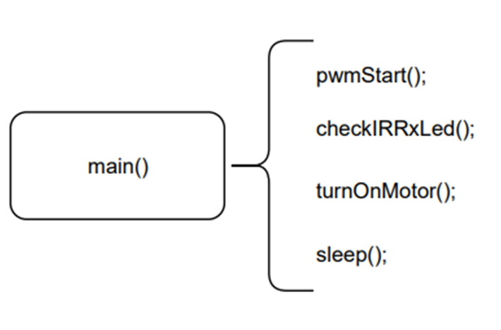

# NISCAPE - Escaping NISC 2021
This project was made during the [NeaPolis Innovation Summer Campus](https://www.neapolisinnovation.info) 2021 (in short, NISC 2021) by the Team 12 _"The Jailbreakers"_.

In alphabetical order:
* Alessandro De Vita (@allexio2288)
* Antonello Florio (@antonelloflorio)
* Chiara Capocello
* Francesco Emilio Di Fruscio
* Francesco Di Nucci (@f-dinucci)
* Marco Rausa (@MarcoRausa)

It is one of the [three joint winner projects.](https://www.facebook.com/NeaPolisInnovation/posts/2985577571657598)

## Description and gameplay
The aim of the project is to create an "escape room" game based on questions regarding the Neapolis Innovation Summer Campus 2021 syllabus. 

The game is divided into two rooms: 
* In the first one, the user has to answer correctly to three questions to open the door and to access the second room. 
* In the second room the difficulty level is increased: the user has to answer to the questions within 4 seconds. To exit from the second room, and so winning the game, the user has to answer correctly to two questions. 

The user has three lives (displayed through LEDs). If he loses them, he loses the game. The user loses one life when the answer is wrong or the time has ran out.

## Game implementation

### Player board (Master)
In summary: _a board that is connected to a computer and is used to show questions and answer, to solve the escape room._ 

The questions will be chosen randomly from a given set and they will be displayed on the PC (using a virtual COM port) with all the possible answers.
 
The letters indexing the answer (A, B, C, D) appear on the OLED display. 
Pay attention, because the positions of the letters varies casually with each question. 
The user will have to select the correct answer by using the joystick and he will receive a feedback on the OLED and the PC. 

When in the second room, the elapsed time is displayed on OLED. 
In particular, the user will see 4 symbols surrounding the letters. A symbol disappears every time a tick (by default, one second) passes. 
If the user fails to answer in 4 ticks the answer is considered wrong and a life is subtracted.

### Room board (Slave)
In short: _a board that manages room's doors._

The opening of the doors is managed by an external board that simulates a power circuit. 
The slave board is triggered in its functions through an IR pulse sent by the master via IR LEDs.

## Block schemes
### Boards overview

### Player board threads

### Room board threads

## BOM and toolchain

### Bill of materials
* 2x Nucleo-64 STM32F401RE boards, running the ChibiOS RTOS suite (https://www.chibios.org/)
* 1x HW-504 Joystick Module
* 1x OLED display I2C, 128x64 pixels, with ssd1306 controller
* 1x couple IR LEDs TX/RX
* 3x LEDs 3mm
* 3x resistors
* 2x SG90 servos

### Toolchain
The project has been developed by [ChibiStudio 2020-04 (GCC 9.0) on Windows](https://osdn.net/projects/chibios/downloads/70767/ChibiStudio_Windows_2020-04.7z/) with  [Open JDK 16.0.1 for Windows](https://download.java.net/java/GA/jdk16.0.1/7147401fd7354114ac51ef3e1328291f/9/GPL/openjdk-16.0.1_windows-x64_bin.zip).

## Schematics

### Player board (Master)
| PIN | Component |
| --- | --- | 
| D15/D14 | OLED |
| D7 | first life led |
| D6 | IR TX |
| D4 | second life led |
| D2 | third life led |

### Slave board

| PIN | Component |
| --- | --- | 
| D7 | IR RX |
| D5 | Servo 1 |
| D4| Servo 2 |

## License
The two parts of the project have some differences in licensing, due to the use of different libraries.
For the details, see the respective READMEs. 
Generally speaking, the code made by the Team 12 is released under MIT/Expat license.

## Other NISC 2021 repositories
These are other projects realized during or for NISC 2021 and then published (might not be a comprehensive list):
* [nisc2021-examples](https://github.com/delloiaconos/nisc2021-examples) by Salvatore Dello Iacono
* [nisc2021-oled-challenge](https://github.com/tontonialberto/nisc2021-oled-challenge) by Alberto Tontoni
* [NISC2021_PWM_example](https://github.com/ciromazzocchi/NISC2021_PWM_example) by Ciro Mazzocchi
